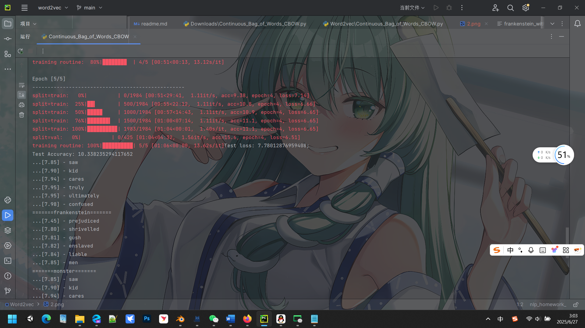

Vocabulary类
1、在Vocabulary类中，mask_token对应的索引通过调用add_token方法赋值给self.__ mask_index__属性。

2、lookup_token方法中，如果self.unk_index >=0，则对未登录词返回__unk_index__。

3、调用add_many方法添加多个token时，实际是通过循环调用__add_token__方法实现的。

CBOWVectorizer类
4、vectorize方法中，当vector_length < 0时，最终向量长度等于__indices__的长度。

5、from_dataframe方法构建词表时，会遍历DataFrame中__context__和__target__两列的内容。

6、out_vector[len(indices):]的部分填充为self.cbow_vocab.__ mask_index__。

CBOWDataset类
7、_max_seq_length通过计算所有context列的__context__的最大值得出。

8、set_split方法通过self._lookup_dict选择对应的__索引列表__和__目标列表__。

9、__getitem__返回的字典中，y_target通过查找__target__列的token得到。

模型结构
10、CBOWClassifier的forward中，x_embedded_sum的计算方式是embedding(x_in).__ sum__(dim=1)。

11、模型输出层fc1的out_features等于__num_embeddings__参数的值。

训练流程
12、generate_batches函数通过PyTorch的__DataLoader__类实现批量加载。

13、训练时classifier.train()的作用是启用__Dropou__和__Batch Normalization__模式。

14、反向传播前必须执行__optimizer__.zero_grad()清空梯度。

15、compute_accuracy中y_pred_indices通过__y_pred.argmax(dim=1)__方法获取预测类别。

训练状态管理
16、make_train_state中early_stopping_best_val初始化为__float('inf')__。

17、update_train_state在连续__args.patience__次验证损失未下降时会触发早停。

18、当验证损失下降时，early_stopping_step会被重置为__0__。

设备与随机种子
19、set_seed_everywhere中与CUDA相关的设置是__torch.cuda__.manual_seed_all(seed)。

20、args.device的值根据__torch.cuda__.is_available()确定。

推理与测试
21、get_closest函数中排除计算的目标词本身是通过continue判断word == __target_word: continue__实现的。

22、测试集评估时一定要调用__classifier.eval()__方法禁用dropout。

关键参数
23、CBOWClassifier的padding_idx参数默认值为__0__。

24、args中控制词向量维度的参数是__args.embedding_size__。

25、学习率调整策略ReduceLROnPlateau的触发条件是验证损失__增加__（增加/减少）。